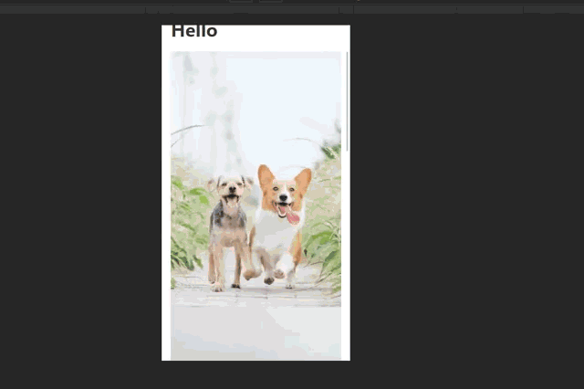

Gatsby Image is:

> A React component specially designed to work seamlessly with Gatsby’s GraphQL queries.
> It accepts a Fluid or Fixed object and uses techniques like blur-up, compression, and even serving the latest image formats for the web like webp.

---

## Art Direction

Art direction is used for
showing different images at different breakpoints
But how does it work?

We create an array of "sources" that is passed into the fluid prop of the Img component. This is simple when you have one image. What if you have multiple images that you are mapping over in your component?

### Gatsby Image

Let's say we have a query of multiple images.

```graphql
export const query = graphql`
  query IndexQuery {
    allImageSharp {
      edges {
        node {
          id
          fluid {
            ...GatsbyImageSharpFluid
          }
        }
      }
    }
  }
`
```

What we get is:

```javascript
{
  "data": {
    "allImageSharp": {
      "edges": [
        {
          "node": {
            "id": "416b3612-afd3-5905-9095-ed4d1a6572e6",
            "fluid": {
              "src": "/static/cd98bbcceaddc0c19a6a791abc7e7317/14b42/jae-park-7GX5aICb5i4-unsplash.jpg"
            }
          }
        },
        {...}
      ]
    }
  }
}
```


What if we want dogs on mobile? Let's do some refactoring.

## Prepare the query

Create a directory called `images` in `src/`. We'll have two folders, one for cats and one for dogs inside `images`.


Place in some cat and dog pictures because the query will fail if they are empty.

In your `gatsby-config`:

```js
{
  resolve: `gatsby-source-filesystem`,
  options: {
    name: `images`,
    path: `${__dirname}/src/images`,
  },
},
```

This will create `File` nodes that will be transformed by `gatsby-transformer-sharp` into `ImageSharp` nodes during build.

Then we'll query for our dog and cat images like so:

> Note: This is a page query and so it is used in a page.

```js
export const query = graphql`
  query IndexQuery {
    cats: allFile(filter: { relativePath: { glob: "cats/*" } }) {
      edges {
        node {
          childImageSharp {
            id
            fluid(maxWidth: 350) {
              ...GatsbyImageSharpFluid_withWebp
            }
          }
        }
      }
    }
    dogs: allFile(filter: { relativePath: { glob: "dogs/*" } }) {
      edges {
        node {
          childImageSharp {
            id
            fluid(maxWidth: 350) {
              ...GatsbyImageSharpFluid_withWebp
            }
          }
        }
      }
    }
  }
`
```

Going down the list:

- `query IndexQuery`: _We name our query IndexQuery_
- `cats: allFile(filter: { relativePath: { glob: "cats/*" } }) {...}`

## Inject the data

_Here we do something a little interesting_.

First, we're using an `alias` to name the result `cats` instead of `allFile`. Then, we're filtering the results by `relativePath`.
Use a glob pattern to grab everything from the `cats` directory. Same thing with the dogs query.

With our two sets of data: `dogs` and `cats` we'll inject them into the page like so:

```js
const IndexPage = ({ data }) => {
  const {
    cats: { edges: cats },
    dogs: { edges: dogs },
  } = data
}
```

Here's what's going on:

- `const IndexPage = ({ data }) => {...}`

_Gatsby strips the query out of the page, sends the result back to the page component as context which we destructure like `{data}`_

- ```js
  const {
    cats: { edges: cats },
    dogs: { edges: dogs },
  } = data
  ```
  _This is classic destructured assignment. Out of `data` we destructure `cats` and `dogs`. Out of `cats` and dogs
  we destructure `edges` and **assign** it the value `cats` and `dogs` respectively_

## Zipping

Now we have two arrays. `[cats] and [dogs]`

```js
const IndexPage = ({ data }) => {
  const {
    cats: { edges: cats },
    dogs: { edges: dogs },
  } = data

  const zippedImages = cats.map((element, index) => {
    return [element, dogs[index]]
  })

  return (
    <Layout>
      <h1>Hello</h1>
      <Animal images={zippedImages} />
    </Layout>
  )
}
```

Here's what's happening in this one:

```js
const zippedImages = cats.map((element, index) => {
  return [element, dogs[index]]
})
```

- _We map over the `cats` array grabbing the `element` and the `index` for each
  entry in the array._

- _Then we return a *new* array with the original item in the array as `element` *AND*
  a `dog` entry at the `index`_

## Put it all together

```js
const Animal = ({ images }) => {
  return (
    <div className="grid">
      {images.map(([cats, dogs]) => {
        const sources = [
          cats.node.childImageSharp.fluid,
          {
            ...dogs.node.childImageSharp.fluid,
            media: `(min-width: 768px)`,
          },
        ]
        return 
      })}
    </div>
  )
}
```

_Here is the component that displays the animals and where the art-direction actually
happens_

- _Map over the array from before with both cats and dogs_
- _Destructure `cat` and `dog` from the array so we can do different things with each_
- _Create a new array called `sources` with the fluid object from `cats` as the first item
  and spread the `dogs` item in an object along with a media key that contains the media query
  you want the `dogs` images to show up at_



There you have it! 🚀
